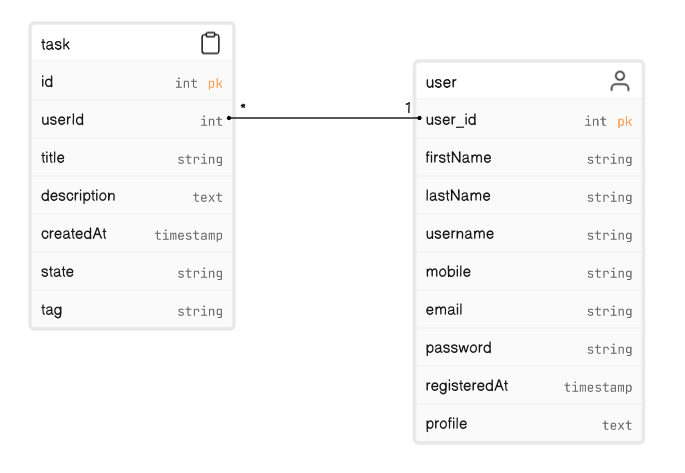

# TaskManagementSystem
## Purpose
The aim of this project was to impress Fidelity Leap program recruiters by demonstrating my skills, quick learning ability and passion for the field.

## Example
https://github.com/garrettm19/TaskManagementSystem/assets/94884228/5d28c3f0-c8e0-4b2d-b857-a0eceab364d9

## OneNote (SDLC)
[onenote:///C:\Users\mgarr\OneDrive\Documents\OneNote%20Notebooks\TaskManagementSystem](https://1drv.ms/o/s!AuMRuyGRDSmageQ9XLBm7kOtjJ-uMQ?e=C0owty)

## Schema

## Create Database

CREATE DATABASE task_manager;

USE task_manager;
Create the user table using the following SQL command:

CREATE TABLE user (
    user_id INT AUTO_INCREMENT PRIMARY KEY,
    firstName VARCHAR(255),
    lastName VARCHAR(255),
    username VARCHAR(255) UNIQUE,
    mobile VARCHAR(15),
    email VARCHAR(255) UNIQUE,
    password VARCHAR(255),
    registeredAt DATETIME,
    profile TEXT
);

CREATE TABLE task (
    id INT AUTO_INCREMENT PRIMARY KEY,
    userId INT,
    title VARCHAR(255),
    description TEXT,
    createdAt DATETIME,
    state VARCHAR(20),
    tag VARCHAR(20),
    FOREIGN KEY (userId) REFERENCES user (user_id)
);

## Create Example Users

INSERT INTO user (firstName, lastName, username, mobile, email, password, registeredAt, profile)
VALUES ('John', 'Doe', 'johndoe1', '1234567890', 'john.doe1@example.com', 'password1', NOW() - INTERVAL 1 DAY, 'Example profile for user 1');

INSERT INTO user (firstName, lastName, username, mobile, email, password, registeredAt, profile)
VALUES ('Jane', 'Smith', 'janesmith2', '9876543210', 'jane.smith2@example.com', 'password2', NOW() - INTERVAL 2 DAY, 'Example profile for user 2');

INSERT INTO user (firstName, lastName, username, mobile, email, password, registeredAt, profile)
VALUES ('Alice', 'Johnson', 'alicejohnson3', '5555555555', 'alice.johnson3@example.com', 'password3', NOW() - INTERVAL 3 DAY, 'Example profile for user 3');

INSERT INTO user (firstName, lastName, username, mobile, email, password, registeredAt, profile)
VALUES ('Bob', 'Brown', 'bobbrown4', '3333333333', 'bob.brown4@example.com', 'password4', NOW() - INTERVAL 1 DAY, 'Example profile for user 4');

INSERT INTO user (firstName, lastName, username, mobile, email, password, registeredAt, profile)
VALUES ('Eva', 'Williams', 'evawilliams5', '7777777777', 'eva.williams5@example.com', 'password5', NOW() - INTERVAL 2 DAY, 'Example profile for user 5');

INSERT INTO user (firstName, lastName, username, mobile, email, password, registeredAt, profile)
VALUES ('Michael', 'Lee', 'michaellee6', '9999999999', 'michael.lee6@example.com', 'password6', NOW() - INTERVAL 3 DAY, 'Example profile for user 6');

## Create Example Tasks

INSERT INTO task (userId, title, description, createdAt, state, tag)
VALUES (1, 'Idea Task 1', 'Work on a new project idea', NOW() - INTERVAL 1 DAY, 'idea', 'work');

INSERT INTO task (userId, title, description, createdAt, state, tag)
VALUES (2, 'Idea Task 2', 'Brainstorm ideas for a presentation', NOW() - INTERVAL 2 DAY, 'idea', 'school');

INSERT INTO task (userId, title, description, createdAt, state, tag)
VALUES (3, 'Idea Task 3', 'Plan a personal creative project', NOW() - INTERVAL 3 DAY, 'idea', 'personal');

INSERT INTO task (userId, title, description, createdAt, state, tag)
VALUES (4, 'Idea Task 4', 'Sketch ideas for a new product', NOW() - INTERVAL 1 DAY, 'idea', 'work');

INSERT INTO task (userId, title, description, createdAt, state, tag)
VALUES (5, 'In Progress Task 1', 'Develop software for a client', NOW() - INTERVAL 2 DAY, 'inprogress', 'work');

INSERT INTO task (userId, title, description, createdAt, state, tag)
VALUES (6, 'In Progress Task 2', 'Write a research paper', NOW() - INTERVAL 3 DAY, 'inprogress', 'school');

INSERT INTO task (userId, title, description, createdAt, state, tag)
VALUES (1, 'In Progress Task 3', 'Build a personal website', NOW() - INTERVAL 1 DAY, 'inprogress', 'personal');

INSERT INTO task (userId, title, description, createdAt, state, tag)
VALUES (2, 'In Progress Task 4', 'Design a new user interface', NOW() - INTERVAL 2 DAY, 'inprogress', 'work');

INSERT INTO task (userId, title, description, createdAt, state, tag)
VALUES (3, 'Needs Review Task 1', 'Edit and proofread a report', NOW() - INTERVAL 3 DAY, 'needsreview', 'school');

INSERT INTO task (userId, title, description, createdAt, state, tag)
VALUES (4, 'Needs Review Task 2', 'Review code for quality assurance', NOW() - INTERVAL 1 DAY, 'needsreview', 'work');

INSERT INTO task (userId, title, description, createdAt, state, tag)
VALUES (5, 'Needs Review Task 3', 'Review and revise a marketing plan', NOW() - INTERVAL 2 DAY, 'needsreview', 'work');

INSERT INTO task (userId, title, description, createdAt, state, tag)
VALUES (6, 'Needs Review Task 4', 'Evaluate and improve a personal project', NOW() - INTERVAL 3 DAY, 'needsreview', 'personal');

INSERT INTO task (userId, title, description, createdAt, state, tag)
VALUES (1, 'Completed Task 1', 'Finish and deliver a client project', NOW() - INTERVAL 1 DAY, 'completed', 'work');

INSERT INTO task (userId, title, description, createdAt, state, tag)
VALUES (2, 'Completed Task 2', 'Submit final version of a thesis', NOW() - INTERVAL 2 DAY, 'completed', 'school');

INSERT INTO task (userId, title, description, createdAt, state, tag)
VALUES (3, 'Completed Task 3', 'Wrap up and showcase a personal artwork', NOW() - INTERVAL 3 DAY, 'completed', 'personal');

INSERT INTO task (userId, title, description, createdAt, state, tag)
VALUES (4, 'Completed Task 4', 'Deliver a software release to customers', NOW() - INTERVAL 1 DAY, 'completed', 'work');

## To Do
This is still a work in progress.
* Registration page needs to redirect to login page
* Tasks need to be fully linked to front-end (Need to have functionality to press on them and view description)
* Delete task functionality
* Comments for each task functionality
* Task progress bars need to be linked to controller
* Recent activity needs to be linked to controller
* Dragging task from one section to another needs to update it in database (possibly caching or batching)
* Functionality for ellipsis near each state (idea, in progress, needs review, completed)
